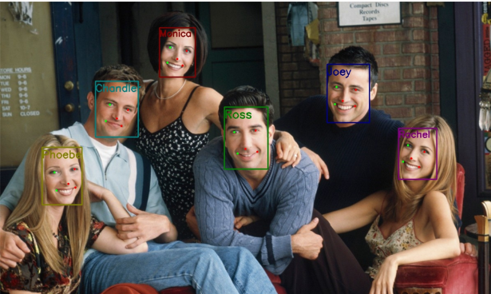
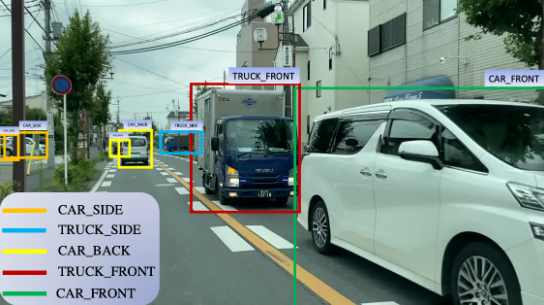

# 需求说明书
仓库public，考虑保密问题隐藏

# 需求沟通与理解
根据沟通，进一步明确项目目标旨在实现功能性需求，并对系统能力的进一步提升进行规划。  
目标1因为传感器限制，深度估计较难实现（相机需要标定，雷达需要硬件），因此主要考虑检测与追踪  
目标2旨在导出算法处理结果，并输出为结构化数据，以便其他业务进行调用  
目标3与目标4为特色功能，需要着重优化  
考虑到项目背景，需要为智能ADB系统的集成留出空间  
测试方法采用符合要求的网络视频。目标3的测试视频比较难找，需要考虑合成视频，或者单独测试  

# 目标优先级
1、在**规定时间**内完成功能性需求  
2、考虑可扩展性  
3、考虑系统性能  

# 系统架构设计
该系统设计的主要难点包括：  
1、处理步骤多，且每个步骤对计算资源的需求不同（cpu or gpu or io），并行程度也不同  
2、需要为未来的可以预期的功能扩展留出设计空间，如引入多模态传感器数据（Lidar、Radar、IMU等）  
3、工期短，需要尽可能大的设计弹性应对突发情况导致的延期风险。这里主要针对开源代码运行环境相互不兼容的问题，短时间来不及重构  

考虑到系统处理能力的弹性以及可扩展性，工程架构采用 管道-过滤器 设计模式。
核心代码主要在**Engine** 以及 **Algorithm** 两个包内。
算法集中在**Algorithm**，为各个模块的具体算法，供Engine类调用。  
过滤器在工程中放在**Engine**

## Engine 
Engine 的对象通过初始化参数设定进程数，通过start()启动多进程。之后可通过SensorEngine抓取传感器输入，或者直接向输入队列输入数据以获取输出
包含SensorEngine、AnnoEngine两个主要模块   
### SensorEngine
负责获取信息输入并推入管道，如相机图像抓取、视频文件读取等。  
Camera、Video类继承SensorEngine基类并借助配置文件进行初始化。  
后续如果需要加入Lidar、Radar、IMU、灯光亮度等信息输入，只需要继承该基类，对接相应的数据抓取接口即可  
### AnnoEngine
负责处理上一级的数据输入，并将处理结果推入输出队列。  
功能包括交通目标检测、追踪、人脸检测、眼睛检测、车辆朝向检测等。  
增加新功能只需应用AnnoEngine对象设置多级过滤器即可。调用方法见Scripts/run.py  

## Algorithm 
考虑到为快速实现功能，需要用到大量开源代码，不同的开源需要不同的python环境，因此部分算法需要在不同的conda环境以http服务形式启动，该python包提供直接接口调用以及http服务两种模式。该目录下为开源算法代码备份，以及适配本系统的接口。
### Detect_and_Track
交通目标检测与追踪算法
### EyeDetect
### Vehicle Orientation
### EnvHelper

## ResultSaving
支持结构化结果数据存储为COCO、Labelme格式，便于后续处理

# 算法方案
现阶段主要考虑**短时间**实现功能性需求，因此以开源项目为主
## Detect_and_Track
### 技术方案：
https://github.com/ultralytics/ultralytics  
### 方案理由：
42.1K star，仓库稳定性有保障，也是最常用的目标检测框架。同时自带byte track追踪算法，检测追踪一体化

## EyeDetect
### 技术方案：https://github.com/deepinsight/insightface
### 方案理由：25.5kstar，性能稳定，集成了人脸检测与关键点定位以及人脸对齐功能，通过5点定位足够确定人眼位置，并映射至标准位姿
### 方案效果：

## Vehicle Orientation
### 技术方案：
https://github.com/sekilab/VehicleOrientationDataset  
### 方案理由：
提供ultralytics版本yolov5 tflite模型，可以与目标检测追踪环境兼容  
### 方案效果：

# 优化思路
1、后续需要加入日志系统以便优化多进程参数配置，提升系统效率  
2、加入配置文件进行系统初始化，避免hard code  
3、重构环境不兼容的算法推理模块，使之适配主进程环境以降低系统开销  
4、可以引入额外的过滤器引擎以筛选长尾数据，降低硬盘负荷  
5、针对智能ADB的一些想法：  
可以参考基准模型在同时段单位时间内检测到的车流量作为标准进行优化。  
系统输入：当前光源参数、当前摄像机图像、当前Lidar点云、交通目标检出率  
系统输出：光源强度变化方向  

# 接口设置
见接口文档

# 代码规范
参考谷歌规范  
https://zh-google-styleguide.readthedocs.io/en/latest/google-python-styleguide/python_style_rules.html  

